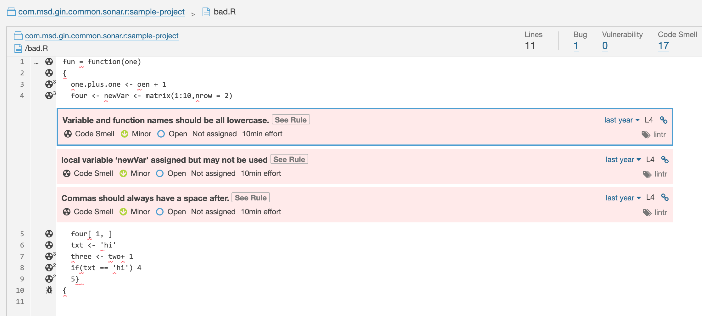

Sonar R Plugin
==============
[](https://travis-ci.org/Merck/sonar-r-plugin)
[](https://sonarcloud.io/dashboard?id=com.msd.gin.common.sonar:sonar-r-plugin)

Adds support for [R language](https://www.r-project.org/) into SonarQube. Currently, it uses output from [lintr tool](https://github.com/jimhester/lintr)
which is processed by the plugin and uploaded into SonarQube server.



Features
--------
- reporting issues found by LintR (by processing its output)

Planned Features
----------------
- syntax highlighting
- code coverage
- code statistics (e.g. number of lines of code)

Extending SonarQube
-------------------
[https://docs.sonarqube.org/display/DEV/Extension+Guide](https://docs.sonarqube.org/display/DEV/Extension+Guide)

Run SonarQube Locally with the Plugin
-------------------------------------
Installed **Java 11** is required to run SonarQube server.

```bash
# build plugin and put it into SonarQube instance
./mvnw clean package
# run SonarQube server
./sonar-local.sh console
# wait for message: SonarQube is up
# stop it by Ctrl-C
```
Repeat previous steps for any changes made in the plugin:
```bash
./mvnw clean package && ./sonar-local.sh console
```

Check logs in different terminal session:
```bash
tail -f -n 0 ./.sonar/sonarqube-*/logs/*
```

[Web UI is running here](http://localhost:9000) (admin access defaults: `admin/admin`)

Sample Project
--------------
[sample-project/README.md](sample-project/README.md)

Add SonarQube into a Project
----------------------------
Follow standard procedure to add SonarQube analysis to existing project:
[https://docs.sonarqube.org/display/SONAR/Analyzing+Source+Code](https://docs.sonarqube.org/display/SONAR/Analyzing+Source+Code)

In case the local SonarQube instance should be used, just update SonarQube server URL to `http://localhost:9000`.

For example in `sonar-project.properties`:
```properties
sonar.host.url=http://localhost:9000
```

Release Process
---------------
- derive release version from current SNAPSHOT in POM
- create new release branch
  - commit release version into POM
  - create tag
  - push
- generate new development version by increasing last number
- checkout master
  - commit new development version
  - push

Script for the above steps:
```
./release.sh
```

Travis CI build does the release process in Github.
